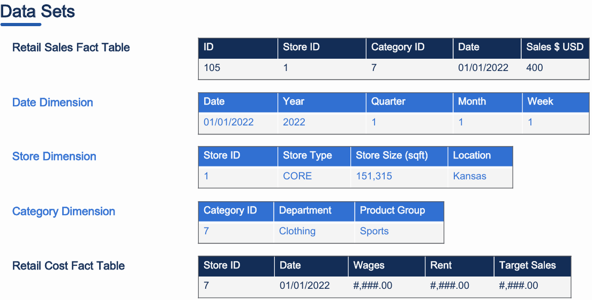
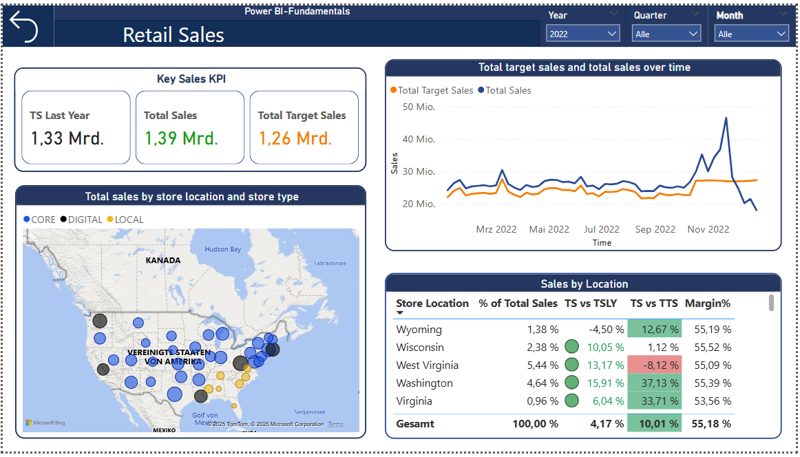

# Dashboard
Erstellung eines interaktiven Dashboards zur Visualisierung der Unternehmensleistung mithilfe von Power BI
## Übersicht
Dieses Projekt wurde im Rahmen der online Weiterbildung „Power BI Fundamentals“ des Corporate Finance Institute auf der Plattform Coursera durchgeführt. Ziel des Projekts war die Erstellung eines Dashboards zur Verfolgung der  Verkaufsleistung eines Unternehmens. Als Datengrundlage dienten die Verkaufsdaten des fiktiven Unternehmens GL Retail Corporation  aus den Jahren 2020, 2021 und 2022. Die Head Rest Bed Company vertreibt Bettzubehör an acht Standorten in den USA und bietet ihre Produkte in vier Kategorien (Bettrahmen, Matratzen, Bettwäsche und Kopfkissen ) unter vier Marken an.

## Daten 
Die verwendeten Daten stammen aus dem oben genannten Kurs. 

## Ergebnis

## Fazit
Mit diesem Dashboard ist es möglich, die Verkaufsleistung pro Standort und pro Zeitraum zu analysieren.
Unter „Leistung“ sind Kennzahlen wie die der Umsatz, der prozentuale Anteil des Umsatzes im ausgewählten Zeitraum im Vergleich zum entsprechenden Zeitraum des Vorjahres sowie die Marge in Prozent zu verstehen. Diese Kennzahlen können nach verschiedenen Dimensionen gefiltert werden, darunter: Zeitraum (Jahr, Quartal, Monat, Woche, Tag), Standort, Produktkategorie (falls erforderlich) und  Produktmarke (falls erforderlich). Mit Ausnahme des Zeitraums lassen sich diese Filter auch auf zwei Zeitreihendiagramme anwenden : die Entwicklung von Umsatz und Marge über die Zeit. 